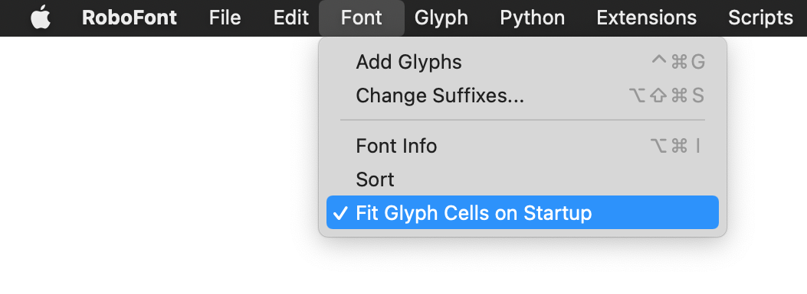

# Fit Glyph Cells
A RoboFont extension that places a button to the left of the glyph cell size slider (below Font Overview). This button, when pressed, sizes the glyph cells such that they’re as large as possible, while all being shown. 
<br><br>
*Note:
Font Overview window’s width also slightly changes, because they can be `float`s, while glyph cell size cannot.*


The setting below resizes the glyph cells to fit, every time you start a new UFO or open an existing file:




### Known issues:

* In Multi-Window (typical) mode, you may experience bad fitting. If so, make sure your `System Preferences > General > Show scroll bars` does not read `Automatically based on mouse or trackpad`.
* If you have open fonts and change your MWM/SWM preference, you may experience weird window/panel behavior unless you restart.


### Versions

```
2023.05.31  New Mechanic icon
2023.02.06  Fix minor bug
2022.01.25  Extension release
2020.04.03  Initial start-up script release
```	


### Thanks:

Frederik Berlaen, Gustavo Ferreira, Frank Grießhammer, Connor Davenport, [Nina Stössinger](https://github.com/ninastoessinger/Suffixer/blob/8c8ace0c31acebf4054847903a3af5925f3bd669/Suffixer.roboFontExt/lib/suffixer.py#L19)

