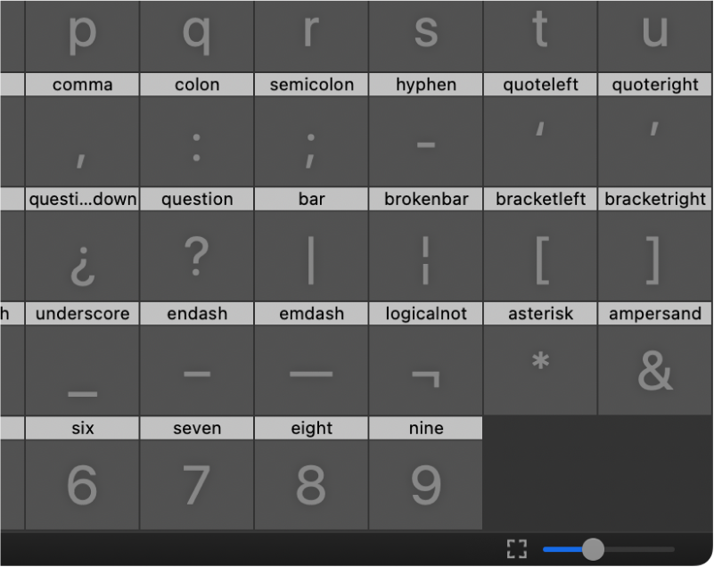
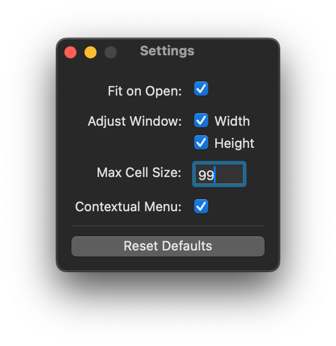

# Fit Glyph Cells

A RoboFont extension that resizes the glyph cells in your Font Overview so that all glyphs fit within view. 

## How it works

It sizes the glyph cells such that they’re as large as possible, while all being shown.

Glyph cells will resize to be flush up against both sides of the font overview, but with minimal empty space below.

## Ways to use

### Button

This extension places a button to the left of the glyph cell size slider (below Font Overview). Click this to resize the glyph cells.



### Right-click

Alternatively, you may right click on the Font Overview and find a Fit Glyph Cells menu item. Click this to resize the glyph cells.

## Settings




### Fit on Open

This setting resizes glyph cells every time you open a Font Overview window, whether it’s a new UFO or an existing one..

### Adjust Window

Cell sizes must be nice, round integers, but window widths can be decimals. This means that for snug fitting to be possible, the window will have to resize. In this setting, select whether you’re willing to let the Font Overview window’s width and/or to shift a bit after the cells resize.

### Max Cell Size

This is the maximum size you’ll allow the cells to get when fitting. For example:

* `0` = No maximum.
* `89` = Don’t enlarge to the point where font dimensions show.
* `99` = Don’t enlarge to the point where layers show.

> Note: The window will still attempt to resize and fit against the cells.


## Known issues:

* In Multi-Window (typical) mode, you may experience bad fitting. If so, make sure your `System Preferences > General > Show scroll bars` does not read `Automatically based on mouse or trackpad`.
* If you have open fonts and change your MWM/SWM preference, you may experience weird window/panel behavior unless you restart.


## Versions

```
2024.04.19  Update to extension bundle, refactor
2023.05.31  New Mechanic icon
2023.02.06  Fix minor bug
2022.01.25  Extension release
2020.04.03  Initial start-up script release
```	


### Thanks:

Frederik Berlaen, Gustavo Ferreira, Frank Grießhammer, Connor Davenport, [Nina Stössinger](https://github.com/ninastoessinger/Suffixer/blob/8c8ace0c31acebf4054847903a3af5925f3bd669/Suffixer.roboFontExt/lib/suffixer.py#L19)

